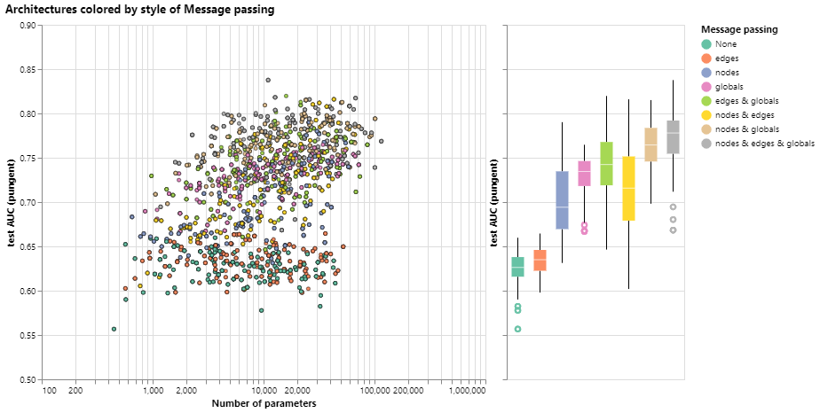

## **Algunas lecciones empíricas de diseño GNN**

Al explorar las opciones de arquitectura anteriores, es posible que haya encontrado que algunos modelos tienen un mejor rendimiento que otros. ¿Hay algunas opciones claras de diseño de GNN que nos darán un mejor rendimiento? Por ejemplo, ¿los modelos GNN más profundos funcionan mejor que los menos profundos? ¿O hay una clara elección entre funciones de agregación? Las respuestas van a depender de los datos, [1] [2], e incluso diferentes formas de caracterizar y construir gráficos pueden dar diferentes respuestas.

Con la siguiente figura, exploramos el espacio de las arquitecturas GNN y el desempeño de esta tarea a través de algunas opciones de diseño importantes: estilo de transmisión de mensajes, dimensionalidad de las incrustaciones, número de capas y tipo de operación de agregación.

Cada punto del diagrama de dispersión representa un modelo: el eje x es el número de variables entrenables y el eje y es el rendimiento.

Diagrama de dispersión del rendimiento de cada modelo frente a su número de variables entrenables.

Lo primero que hay que notar es que, sorprendentemente, un mayor número de parámetros se correlaciona con un mayor rendimiento. Los GNN son un tipo de modelo muy eficiente en cuanto a parámetros: incluso para una pequeña cantidad de parámetros (3k) ya podemos encontrar modelos con alto rendimiento.

A continuación, podemos observar las distribuciones de rendimiento agregadas en función de la dimensionalidad de las representaciones aprendidas para diferentes atributos de gráficos.

Rendimiento agregado de modelos en diferentes dimensiones de nodo, borde y globales.

Podemos notar que los modelos con mayor dimensionalidad tienden a tener un mejor rendimiento medio y de límite inferior, pero no se encuentra la misma tendencia para el máximo. Algunos de los modelos de mejor rendimiento se pueden encontrar para dimensiones más pequeñas. Dado que una mayor dimensionalidad también va a involucrar un mayor número de parámetros, estas observaciones van de la mano con la figura anterior.

A continuación, podemos ver el desglose del rendimiento en función del número de capas GNN.

Gráfico de número de capas frente al rendimiento del modelo y diagrama de dispersión del rendimiento del modelo frente al número de parámetros. Cada punto está coloreado por el número de capas.

El diagrama de caja muestra una tendencia similar, mientras que el rendimiento medio tiende a aumentar con el número de capas, los modelos de mejor rendimiento no tienen tres o cuatro capas, sino dos. Además, el límite inferior de rendimiento disminuye con cuatro capas. Este efecto se ha observado antes, los GNN con un mayor número de capas transmitirán información a una distancia mayor y pueden correr el riesgo de que sus representaciones de nodos se 'diluyan' a partir de muchas iteraciones sucesivas. [3]

En general, parece que la suma tiene una mejora muy leve en el rendimiento medio, pero max o mean pueden dar modelos igualmente buenos. Esto es útil para contextualizar cuando se observan [las capacidades discriminatorias/expresivas](https://distill.pub/2021/gnn-intro/#comparing-aggregation-operations) de las operaciones de agregación.

Las exploraciones anteriores han dado mensajes contradictorios. Podemos encontrar tendencias medias en las que una mayor complejidad proporciona un mejor rendimiento, pero podemos encontrar contraejemplos claros en los que los modelos con menos parámetros, número de capas o dimensionalidad funcionan mejor. Una tendencia mucho más clara se refiere a la cantidad de atributos que se transmiten información entre sí.

Aquí desglosamos el rendimiento según el estilo de transmisión de mensajes. En ambos extremos, consideramos modelos que no se comunican entre entidades gráficas ("ninguna") y modelos que tienen mensajes pasados ​​entre nodos, bordes y globales.

Gráfico de transmisión de mensajes frente al rendimiento del modelo y diagrama de dispersión del rendimiento del modelo frente al número de parámetros. Cada punto está coloreado por el paso del mensaje. 

En general, vemos que cuantos más atributos del gráfico se comuniquen, mejor será el rendimiento del modelo promedio. Nuestra tarea se centra en las representaciones globales, por lo que aprender explícitamente este atributo también tiende a mejorar el rendimiento. Nuestras representaciones de nodos también parecen ser más útiles que las representaciones de bordes, lo que tiene sentido ya que se carga más información en estos atributos.

Hay muchas direcciones en las que puede ir desde aquí para obtener un mejor rendimiento. Deseamos destacar dos direcciones generales, una relacionada con algoritmos gráficos más sofisticados y otra hacia el gráfico en sí.

Una de las fronteras de la investigación GNN no es la creación de nuevos modelos y arquitecturas, sino “cómo construir gráficos”, para ser más precisos, dotar a los gráficos de estructuras o relaciones adicionales que se puedan aprovechar. Como vimos en términos generales, cuanto más se comunican los atributos del gráfico, más tendemos a tener mejores modelos. En este caso particular, podríamos considerar hacer que los gráficos moleculares sean más ricos en características, agregando relaciones espaciales adicionales entre nodos, agregando bordes que no sean enlaces o relaciones explícitas que se puedan aprender entre subgráficos.

[img1]: visualization.png "Figura 1"

[img2]: visualization2.png "Figura 2"

[img3]: visualization3.png "Figura 3"

[img4]: visualization4.png "Figura 4"

# **Referencias**
1. Gráfico de evaluación comparativa Redes neuronales
V.P. Dwivedi, CK Joshi, T. Laurent, Y. Bengio, X. Bresson.
2020
2. Espacio de diseño para redes neuronales gráficas
J. You, R. Ying, J. Leskovec. 2020.
3. Agregación de vecindario principal para redes gráficas 
G. Corso, L. Cavalleri, D. Beaini, P. Lio, P. Velickovic. 2020.
