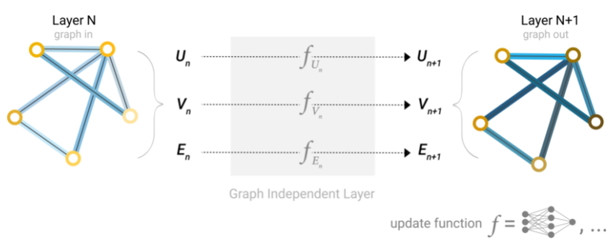

# Gentil introducción a Redes Neuronales de Grafos (*Graph Neural Networks* o *GNN*)

Las redes neuronales han sido aprovecahdas para implementarse en los gráficos o grafos. A continuación, se explora y explica algunos componentes indispensable para poder constuir una red neuronal gráfica y las opciones de diseño detrás de ellos.

![Redes neuronales gráficas][img1]

Este articulo es una parte de dos publicaciones creadas por Distill sobre redes neuronales gráficas. Para entender cómo las convoluciones sobre imágenes se generalizan naturalmente a convoluciones gráficas, se puede visitar el siguiente enlace: [***Comprender las convoluciones en los gráficos***](https://distill.pub/2021/understanding-gnns/) [1].

Los gráficos siempre se encuentran a nuestro alrededor; objetos del mundo real a menudo se definen en términos de conexiones con otros objetos. Estas conexiones y objetos forman un conjunto que de manera natural pueden ser llamados como gráficos. Algunos investigadores se han dado a la tarea de desarrollar y crear redes neuronales de gráficos o GNN, es decir, estas redes operan en datos de gráficos [2]. El desarrollo a permitido que las aplicaciones en la práctica han aumentado sus capacidades y un poder expresivo, estas aplicaciones van desde la detección de noticias falsas, predicción de tráfico, hasta el descubrimiento de antibacterianos.

Este trabajo se divide en cuatro partes tratando de explicar las redes neuronales gráficas modernas. En primer lugar, se analiza qué tipo de datos se expresan de forma más natural en forma de gráfico y algunos ejemplos comunes. En segundo lugar, se explora qué hace que los gráficos sean diferentes de otros tipos de datos y algunas de las elecciones especializadas que se deben hacer al usar gráficos. En tercer lugar, se construye un GNN moderno, recorriendo cada una de las partes del modelo, comenzando con innovaciones históricas de modelado en el campo. Se procede a mostrar gradualmente una implementación básica a un modelo GNN de última generación. En cuarto y último lugar, se proporciona un campo de juegos GNN donde puede jugar con una tarea y un conjunto de datos de palabras reales para construir una intuición más sólida de cómo cada componente de un modelo GNN contribuye a las predicciones que hace.

## **Qué es una gráfica o grafo**

Comenzaremos con lo que es una gráfica. Un gráfico representa las relaciones (bordes) entre una colección de entidades (nodos).

![Componentes de un grafo][img2]

Algunos componentes de los gráficos son:
- Vértices (o nodos)
- Aristas (o bordes)
- Atributos globales (o nodo maestro)

Estos componentes pueden almacenar información en cada una de estas partes del gráfico.

Además, podemos especializar gráficos al asociar la direccionalidad a los bordes (dirigidos, no dirigidos).

![Direccionalidad de los bordes][img3]

Los bordes se pueden dirigir, donde un borde **e** tiene un nodo fuente, **vsrc** y un nodo de destino **vdst**. En este caso, la información fluye desde **vsrc** a **vdst**. También pueden ser no dirigidos, donde no existe una noción de nodos de origen o destino, y la información fluye en ambas direcciones. Tenga en cuenta que tener un solo borde no dirigido es equivalente a tener un borde dirigido desde **vsrc** a **vdst**, y otro borde dirigido desde **vdst** a **vsrc**.

Esto puede parecer muy abstracto, ya que los gráficos son estructuras de datos muy flexibles. Pero se muestran algunos ejemplos en la siguiente sección.

# **Gráficos y dónde encontrarlos**

Probablemente se tenga noción o conocimiento sobre algunos tipos de datos gráficos, las redes sociales es un ejemplo de ellos. Sin embargo, los gráficos son una representación de datos extremadamente poderosa y general, se mostrarán dos tipos de datos que quizás no crea que puedan modelarse como gráficos: imágenes y texto. Esto puede resultar contradictorio o poco probable, pero se puede aprender más sobre simetría y estructura de las imágenes y el texto al verlos como gráficos.

## **Imágenes como gráficos**

Las imágenes normalmente son pensadas como cuadriculas rectangulares que almacenan pixeles y son representadas como matrices. Otra forma de ver las imagenes es como gráficos con estructutra regular donde cada pixel nos representa un nodo y se conecta a través de un borde a los pixeles adyacentes. Cada píxel sin borde tiene exactamente 8 vecinos, y la información almacenada en cada nodo es un vector tridimensional que representa el valor RGB del píxel.

Una forma de visualizar la conectividad de un gráfico es a través de su matriz de adyacencia. Ordenamos los nodos, en este caso cada uno de 25 píxeles en una imagen simple de 5x5 de una carita sonriente, y llenamos una matriz de **nnodos x nnodos** con una entrada si dos nodos comparten un borde.

![Imagenes como gráficos][img4]

## **Texto como gráficos**

Podemos digitalizar texto asociando índices a cada carácter, palabra o ficha, y representando el texto como una secuencia de estos índices. Esto crea un gráfico dirigido simple, donde cada carácter o índice es un nodo y está conectado a través de un borde al nodo que lo sigue.

![Textos como gráficos][img5]

En la práctica no se suele codificar así tanto texto como imágenes: estas representaciones gráficas son redundantes ya que todas las imágenes y todo el texto tendrán estructuras muy regulares. Las imágenes tienen una estructura de bandas en su matriz de adyacencia porque todos los nodos (píxeles) están conectados en una cuadrícula. La matriz de adyacencia para el texto es solo una línea diagonal, porque cada palabra solo se conecta con la palabra anterior y con la siguiente.

## **Datos con valores gráficos en la naturaleza**

Pasemos a los datos que están estructurados de forma más heterogénea. En estos ejemplos, el número de vecinos de cada nodo es variable (a diferencia del tamaño de vecindario fijo de imágenes y texto). Estos datos son difíciles de expresar de otra manera que no sea un gráfico.

### **Moléculas como gráficos.** Todas las partículas están interactuando, pero cuando un par de átomos están atrapados a una distancia estable entre sí, decimos que comparten un enlace covalente. Diferentes pares de átomos y enlaces tienen diferentes distancias (por ejemplo, enlaces simples, enlaces dobles). Es una abstracción muy conveniente y común describir este objeto 3D como un gráfico, donde los nodos son átomos y los bordes son enlaces covalentes. [3]

![Moléculas como gráficos][img6]

### **Redes sociales como gráficos.** Las redes sociales son herramientas para estudiar patrones de comportamiento colectivo de personas, instituciones y organizaciones. Podemos construir un gráfico que represente grupos de personas modelando individuos como nodos y sus relaciones como bordes.

![Redes sociales como gráficos 1][img7]

A diferencia de los datos de imagen y texto, las redes sociales no tienen matrices de adyacencia idénticas.

![Redes sociales como gráficos 2][img8]

### **Redes de citas como gráficos.** Podemos visualizar estas redes de citas como un gráfico, donde cada artículo es un nodo y cada borde dirigido es una cita entre un artículo y otro. Además, podemos agregar información sobre cada artículo en cada nodo, como una palabra incrustada del resumen. [4] [5] [6]

La estructura de los gráficos del mundo real puede variar mucho entre diferentes tipos de datos; algunos gráficos tienen muchos nodos con pocas conexiones entre ellos, o viceversa. Los conjuntos de datos de gráficos pueden variar ampliamente (tanto dentro de un conjunto de datos dado como entre conjuntos de datos) en términos de la cantidad de nodos, bordes y conectividad de los nodos.

| Conjunto de datos | Dominio | Gráficas | Nodos | Bordes | Min | Significar | Max |
| -- | -- | -- | -- | -- | -- | -- | -- |
| club de karate | Red social | 1 | 34 | 78 |  | 4.5 | 17 |
| qm9 | Pequeñas moleculas | 134k | <=9 | <=26> | 1 | 2 | 5 |
| Cora | Red de citas | 1 | 23.166 | 91.5 | 1 | 7.8 | 379 |
| Enlaces de Wikipedia | Gráfico de conocimiento | 1 | 12 M | 378 M |  | 62,24 | 1 M |

Resumen de estadísticas sobre gráficos que se encuentran en el mundo real. Los números dependen de las decisiones de caracterización. Se pueden encontrar estadísticas y gráficos más útiles en KONECT [7]

# **¿Qué tipo de problemas tienen los datos estructurados en gráficos?**

Hay tres tipos generales de tareas de predicción en gráficos: nivel de gráfico, nivel de nodo y nivel de borde.

En una tarea a nivel de gráfico, predecimos una sola propiedad para un gráfico completo. Para una tarea a nivel de nodo, predecimos alguna propiedad para cada nodo en un gráfico. Para una tarea a nivel de borde, queremos predecir la propiedad o presencia de bordes en un gráfico.

Para los tres niveles de problemas de predicción descritos anteriormente (nivel de gráfico, nivel de nodo y nivel de borde), se muestra que todos los siguientes problemas se pueden resolver con una sola clase de modelo, el GNN.

## **Clases de problemas de predicción de gráficos**

### **Tarea a nivel de gráfico**

En una tarea a nivel de gráfico, nuestro objetivo es predecir la propiedad de un gráfico completo. Por ejemplo, para una molécula representada como un gráfico, podríamos querer predecir a qué huele la molécula o si se unirá a un receptor implicado en una enfermedad.

![Tarea a nivel de gráfico][img9]

Esto es análogo a los problemas de clasificación de imágenes con MNIST y CIFAR, donde queremos asociar una etiqueta a una imagen completa. Con el texto, un problema similar es el análisis de sentimientos, en el que queremos identificar el estado de ánimo o la emoción de una oración completa a la vez.

### **Tarea a nivel de nodo**

Las tareas a nivel de nodo están relacionadas con la predicción de la identidad o función de cada nodo dentro de un gráfico.

![Tarea a nivel de nodo][img10]

Siguiendo la analogía de la imagen, los problemas de predicción a nivel de nodo son análogos a la segmentación de la imagen , donde intentamos etiquetar el papel de cada píxel en una imagen. Con el texto, una tarea similar sería predecir las partes del discurso de cada palabra en una oración (por ejemplo, sustantivo, verbo, adverbio, etc.).

### **Tarea a nivel de borde**

Un ejemplo de inferencia a nivel de borde es la comprensión de la escena de la imagen. Más allá de identificar objetos en una imagen, los modelos de aprendizaje profundo se pueden utilizar para predecir la relación entre ellos. Podemos expresar esto como una clasificación de nivel de borde: dados nodos que representan los objetos en la imagen, deseamos predecir cuál de estos nodos comparte un borde o cuál es el valor de ese borde. Si deseamos descubrir conexiones entre entidades, podríamos considerar el gráfico completamente conectado y basándonos en su valor predicho podar los bordes para llegar a un gráfico disperso.

En (b), arriba, la imagen original (a) se ha segmentado en cinco entidades: cada uno de los luchadores, el árbitro, la audiencia y la colchoneta. (C) muestra las relaciones entre estas entidades.

![Tarea a nivel de borde 1][img11]

A la izquierda tenemos un gráfico inicial construido a partir de la escena visual anterior. A la derecha se muestra un posible etiquetado de borde de este gráfico cuando se podaron algunas conexiones en función de la salida del modelo.

![Tarea a nivel de borde 2][img12]

## **Los desafíos del uso de grafos en Machine Learning**
El primer desafío es pensar cómo representaremos los grafos para que sean compatibles con las redes neuronales.
Los grafos tienen hasta cuatro tipos de información que potencialmente pueden ser usadas para hacer predicciones: nodos, aristas, contexto global y conectividad. 
Representar los primeros tres puede ser sencillo, por ejemplo, con los nodos podemos formar una matriz N donde por cada índice i en N se almacene una característica del nodo i.
Sin embargo, representar la conectividad del grafo es más complicado. La opción más obvia sería usar la matriz de adyacencia, ya que es fácilmente tensorizable. Sin embargo, existen dos inconvenientes principales:

- Si tenemos un grafo con una cantidad de nodos muy grande y sabemos que la cantidad aristas por nodo pueden variar desde muy pocas a muchas, pueden existir casos en que las matrices de adyacencia sean muy ineficientes en el espacio, por ejemplo, si tenemos muchos nodos con muy pocas aristas, como en el caso del conjunto de datos qm9 que observábamos en la tabla de otros ejemplos de grafos en la sección anterior.
- Puede haber muchas matrices de adyacencia que codifiquen la misma conectividad, por ejemplo, al permutar los nodos en la matriz de adyacencia. Al introducir cada matriz de adyacencia a una red neuronal profunda, no hay garantía de que estas diferentes matrices produzcan el mismo resultado (no son invariantes de permutación) aunque representen el mismo grafo.

<figcaption style='text-align:center'><small>Figura 21. Dos matrices de adyacencia que representan al mismo grafo. Observe cómo los nodos fueron permutados.</small></figcaption>

Observe en la siguiente figura las diferentes matrices de adyacencia que pueden describir a este pequeño grafo de cuatro nodos:

<figcaption style='text-align:center'><small>Figura 22. En la parte inferior las diferentes matrices de adyacencia para el grafo de la parte superior.</small></figcaption>

<iframe width="560" height="315" src="https://www.youtube.com/embed/kWSOZ9fv2Oo" title="YouTube video player" frameborder="0" allow="accelerometer; autoplay; clipboard-write; encrypted-media; gyroscope; picture-in-picture" allowfullscreen></iframe>

Ahora imagine cuántas matrices de adyacencia posibles tendrá el ejemplo de la figura 21.
Una forma elegante y eficiente de representar matrices dispersas son las listas de adyacencia. Estas describen la conectividad de la arista $e_k$ entre los nodos $n_i$ y $n_j$ como una tupla $(i,j)$ en la k-ésima entrada de una lista de adyacencias. De esta manera evitamos hacer computación y almacenamiento de las partes desconectadas del grafo y no necesitamos procesar las $n^2$ entradas de la matriz de adyacencia.

<figcaption style='text-align:center;'><small>Figura 23. A la izquierda el grafo. A la derecha su representación tensorial (los tensores 'Nodes', 'Edges' y ‘Global’ almacenan las características escalares de los nodos, aristas y contexto global, respectivamente. Mientras que la lista de adyacencias almacena la conectividad.</small></figcaption>

<iframe width="560" height="315" src="https://www.youtube.com/embed/nQVglhibUr0" title="YouTube video player" frameborder="0" allow="accelerometer; autoplay; clipboard-write; encrypted-media; gyroscope; picture-in-picture" allowfullscreen></iframe>

Se debería notar que en la figura 23 se utilizan características escalares por nodo/arista/global, es decir, el tensor Nodes almacena una sola característica por cada nodo en el grafo, el tensor Edges almacena una sola característica por cada arista en el grafo, etcétera. En la realidad es más práctico tener vectores de características por cada nodo/arista/global.

# **Graph Neural Networks**

Una Red Neuronal de Grafos (GNN por sus siglas en inglés) es una transformación optimizable sobre todos los atributos del grafo (nodos, aristas, contexto global) que preserva las simetrías del grafo (invarianza a la permutación)
Vamos a construir una GNN utilizando el marco de “red neuronal de paso de mensajes” propuesto por Gilmer et al. Utilizando los esquemas de la arquitectura Graph Nets introducidos por Battaglia et al. Las GNN adoptan una arquitectura “grafo a la entrada – grafo a la salida”, por lo que se introducen las características de los nodos, bordes y contexto global de un grafo a la GNN donde se transforman progresivamente sin cambiar la conectividad del grafo entrante.

## **La GNN más simple**

Tomando en cuenta que por cada nodo/arista/global tenemos un vector de características (a diferencia de la figura 23 en que tenemos escalares por cada nodo/arista/global), podemos empezar a construir la GNN.

La GNN más simple consiste en aprender nuevos valores del vector de características para todos los atributos del grafo (nodos, aristas, contexto global). Esta GNN utiliza una red perceptrón multicapa (MLP) o cualquier otro modelo de red neuronal diferenciable representado con f, pero una por cada componente del grafo, es decir, una MLP procesa los vectores de características de los nodos, otra MLP independiente procesa los vectores de características de las aristas, y una tercera MLP independiente procesa el vector de características del contexto global. El vector de características de cada nodo se pasa a través de la MLP correspondiente y se recupera un nodo aprendido. Se hace lo mismo para el vector de características de cada una de las aristas al pasarlas por su MLP correspondiente, y también para el contexto global.

<figcaption style='text-align:center;'><small>Figura 24. Modelo simple</small></figcaption>

<iframe width="560" height="315" src="https://www.youtube.com/embed/6gH1o0yzd3g" title="YouTube video player" frameborder="0" allow="accelerometer; autoplay; clipboard-write; encrypted-media; gyroscope; picture-in-picture" allowfullscreen></iframe>

Debido a que un GNN no actualiza la conectividad del grafo de entrada, podemos describir el grafo de salida con la misma lista de adyacencia y la misma cantidad de vectores de características del grafo de entrada. Sin embargo, el grafo de salida ha actualizado el contenido de cada uno de estos vectores de características pertenecientes a cada nodo, cada arista y el contexto global.
Veamos un ejemplo. Si queremos hacer una tarea de clasificación binaria en los nodos, y el grafo ya contiene información en los propios nodos, el enfoque es sencillo: por cada vector de características de cada nodo se aplica un clasificador lineal. Es decir, solo necesitamos una red perceptrón (en este caso de una sola capa) representada por c, para procesar el componente ‘nodos’ del grafo.

<figcaption style='text-align:center;'><small>Figura 25. Tarea binaria, modelo simple</small></figcaption>

<iframe width="560" height="315" src="https://www.youtube.com/embed/nRfC-SE1FBA" title="YouTube video player" frameborder="0" allow="accelerometer; autoplay; clipboard-write; encrypted-media; gyroscope; picture-in-picture" allowfullscreen></iframe>

## **Predicciones de GNN por Agrupamiento de Información**

El último ejemplo anterior muestra el caso más simple de una tarea de clasificación en los nodos. Pero no siempre es tan simple. Por ejemplo, es posible tener información almacenada en las aristas del grafo, pero no tener información almacenada en los nodos, y aún así, necesitar hacer predicciones o tareas en los nodos. Entonces, necesitamos una forma de recopilar información de las aristas y dársela a los nodos para la predicción. Podemos hacer esto mediante agrupamiento. El agrupamiento procede en dos pasos:

- **Recolección**: Para cada elemento a ser agrupado (ya sea varios nodos, varias aristas, o el contexto global), se recolectan sus vectores de características y se concatenan armando una matriz.
- **Agregación**: Los vectores de características reunidos en la matriz se agregan, generalmente a través de una operación suma (compactando la dimensión de la matriz).

Representamos la operación de agrupamiento mediante la letra $\rho$, y denotamos que estamos recolectando información desde las aristas hacia los nodos como $\rho_{E_n→V_n }$.

![Figura 26. El nodo seleccionado es el remarcado con negro. Se puede observar a la derecha tres vectores de características que se van a sumar, concatenados desde arriba hacia abajo formando una matriz. La primera fila corresponde con el vector de características del nodo, mientras que las otras dos representan los vectores de características recolectados desde las aristas adyacentes al nodo. Luego se hace la operación de agregación mediante la suma, compactando la matriz a un único vector de características agrupado.](img26.PNG)
<figcaption style='text-align:center;'><small>Figura 26. El nodo seleccionado es el remarcado con negro. Se puede observar a la derecha tres vectores de características que se van a sumar, concatenados desde arriba hacia abajo formando una matriz. La primera fila corresponde con el vector de características del nodo, mientras que las otras dos representan los vectores de características recolectados desde las aristas adyacentes al nodo. Luego se hace la operación de agregación mediante la suma, compactando la matriz a un único vector de características agrupado.</small></figcaption>

<figcaption style='text-align:center;'><small>Figura 27. En este caso a la derecha se observan cinco vectores de características concatenados en la matriz 5x8. La primera fila corresponde con el vector de características del nodo resaltado con negro, mientras que las otras cuatro corresponde con los vectores de características de las aristas adyacentes a dicho nodo. En este caso la matriz se compacta a un vector 1x8 mediante la operación suma, obteniendo el vector agrupado..</small></figcaption>

En una tarea, si solo tenemos disponibles las características de las aristas y queremos hacer predicción de información binaria en los nodos, podemos usar agrupamiento para enrutar (o pasar) información a donde sea necesaria para lograrlo. El modelo que representa este caso es el siguiente:

<figcaption style='text-align:center;'><small>Figura 28.</small></figcaption>

En una tarea, si solo tenemos disponibles las características de los nodos y queremos hacer predicción de información binaria en las aristas, podemos usar agrupamiento. El modelo que representa este caso es el siguiente:

<figcaption style='text-align:center;'><small>Figura 29.</small></figcaption>

En una tarea, si solo tenemos disponibles las características de los nodos y queremos hacer predicción de información binaria en el contexto global, podemos usar agrupamiento. El modelo que representa este caso es el siguiente:

<figcaption style='text-align:center;'><small>Figura 30.</small></figcaption>

En los ejemplos anteriores, el modelo de clasificación $c$ puede ser remplazado fácilmente con cualquie modelo diferenciable, o adaptado a la clasificación multiclase utilizando un modelo lineal generalizado.

<figcaption style='text-align:center;'><small>Figura 31. Tarea de predicción extremo a extremo con un modelo GNN</small></figcaption>

Hemos demostrado que podemos construir un modelo de GNN simple, y hacer predicciones binarias enrutando información entre diferentes partes del grafo. Esta técnica de agrupamiento servirá como bloque constructor para diseñar modelos GNN más sofisticados. Si tenemos nuevos atributos en el grafo (aparte de nodos/aristas/global), solo tenemos que definir cómo pasar información de un atributo a otro.

Nota que en la formulación de la GNN más simple (ver figura 25 de la subsección anterior) no usamos la conectividad del grafo dentro de la capa GNN. Cada nodo es procesado independientemente, así también cada arista, de igual manera el contexto global. Solo usamos la conectividad cuando agrupamos información para hacer la predicción (como en las figuras 28, 29 y 30).

<iframe width="560" height="315" src="https://www.youtube.com/embed/5xTavAIhOok" title="YouTube video player" frameborder="0" allow="accelerometer; autoplay; clipboard-write; encrypted-media; gyroscope; picture-in-picture" allowfullscreen></iframe>

## **Paso de mensajes entre partes del grafo**

Es una versión más sofisticada de hacer predicciones usando agrupamiento dentro de la capa GNN, con el fin de hacer que nuestros vectores aprendidos sean concientes de la conectividad del grafo. Podemos hacerlo usando el Paso de Mensajes, donde los nodos o aristas vecinos intercambian información que influye en la actualización de los vectores de características de los demás.

El paso de mensajes consiste en tres pasos:

- Para cada nodo del grafo, reunir todos los vectores de características (o mensajes) asociados a los nodos vecinos.
- Agregar todos los mensajes a través de una función agregada (como la suma).
- Todos los mensajes agrupados se pasan a través de una función de actualización, generalmente una red neuronal aprendida.

<figcaption style='text-align:center;'><small>Figura 32. Agrupamiento dentro de la capa GNN y posterior actualización del grafo</small></figcaption>

> En la subsección anterior no se daba este caso, observa que en las figuras 25, 28, 29 y 30, a la izquierda hay un grafo que indica "Final Layer". Esto quiere decir, que primero se aplica el modelo GNN de la figura 24 en la que, por ejemplo, si solo se tienen disponibles como información los vectores de características de los nodos, en la GNN se actualizan solo los nodos y se obtiene el resultado de la "Layer N+1" con los vectores de características de los nodos actualizados, esto se hace iterativamente hasta llegar a la "Final Layer". Posteriormente, si se quieren hacer predicciones sobre las aristas, se hace el agrupamiento de información de los nodos pasándolas a las aristas como se observa en la figura 29. Todo esto se resumió en la figura 31: los "GNN blocks" representan la GNN de la figura 24, mientras que el "Classification Layer" es la tarea final de clasificación del ejemplo que explicábamos posterior a que se de el Agrupamiento de Información, es decir, el agrupamiento de información se encuentra entre "Transformed Graph" y "Classification Layer".

En el caso del Paso de Mensajes, es dentro de la misma GNN donde se hace este paso de información. Así como el Agrupamiento de Información puede ser aplicado ya sea en nodos o aristas, el Paso de Mensajes puede ocurrir entre ya sea nodos o aristas:

Cuando esta secuencia de operaciones se aplica una sola vez, hablamos del modelo más simple de Paso de Mensajes en una GNN. 

Esto recuerda a la convolución estándar: en esencia, el paso de mensajes y la convolución son operaciones para agregar y procesar la información de los vecinos de un elemento con el fin de actualizar el valor del elemento. En los grafos, el elemento es un nodo, y en las imágenes, el elemento es un píxel. Sin embargo, el número de nodos vecinos en un grafo puede ser variable, a diferencia de una imagen donde cada píxel tiene un número establecido de elementos vecinos.

Al apilar información en el mensaje y pasarlo todo junto en las capas GNN, un nodo puede eventualmente incorporar información de todo el gráfico: después de tres capas, un nodo tiene información sobre los nodos a tres pasos de distancia.

Podemos actualizar el diagrama para incluir esta nueva fuente de información para los nodos de la siguiente manera:

<figcaption style='text-align:center;'><small>Figura 33. Diagrama esquemático del modelo de una GCN (Graph Convolutional Network), que actualiza los vectores de características de los nodos de un grafo por medio del agrupamiento de los vectores de características de los nodos vecinos a una distancia de un grado</small></figcaption>

## **Aprendizaje de representaciones de aristas**

Nuestro conjunto de datos no siempre contiene todos los tipos de información (nodo, arista y contexto global). Cuando queremos hacer una predicción en nodos, pero nuestro conjunto de datos solo tiene información de aristas, mostramos anteriormente cómo usar la agrupación para enrutar la información de las aristas a los nodos, pero solo en el paso de predicción final del modelo. Podemos compartir información entre nodos y aristas dentro de la capa GNN utilizando el paso de mensajes.

Podemos incorporar la información de las aristas vecinas de la misma manera que usamos la información del nodo vecino anteriormente, agrupando primero la información de las aristas, transformando con una función de actualización y almacenando.

Sin embargo, la información del nodo y aristas almacenada en un grafo no son necesariamente del mismo tamaño o forma, por lo que no está claro de inmediato cómo combinarlos. Una forma es aprender un mapeo lineal desde el espacio de aristas hasta el espacio de nodos, y viceversa. Alternativamente, se pueden concatenar juntos antes de la función de actualización.

<figcaption style='text-align:center;'><small>Figura 34. Arquitectura esquemática de una capa de Paso de Mensajes. El primer paso "prepara" un mensaje compuesto por la información de una arista y sus nodos conectados, y entonces "pasa" el mensaje al nodo.</small></figcaption>

Determinar qué atributos del grafo actualizamos y en qué orden los actualizamos es una decisión de diseño al construir la GNN. Podríamos elegir si actualizar los vectores de características de los nodos antes de los vectores de características de las aristas, o al revés. Esta es un área abierta de investigación con una variedad de soluciones. Por ejemplo, podríamos actualizar de una manera de "tejido" donde tenemos cuatro representaciones actualizadas que se combinan en nuevas representaciones de nodo y arista: nodo a nodo (lineal), de arista a arista (lineal), de nodo a arista (capa de arista), de arista a nodo (capa de nodo).

<figcaption style='text-align:center;'><small>Figura 35. Algunas de las diferentes formas en que podríamos combinar la representación de aristas y nodos en una capa GNN.</small></figcaption>

## **Adición de representaciones de contexto global**

Hay un defecto con las redes que hemos descrito hasta ahora: los nodos que están lejos entre sí en el grafo pueden nunca ser capaces de transferir información de manera eficiente entre sí, incluso si aplicamos el paso de mensajes varias veces. Para un nodo, si tenemos k-capas, la información se propagará a lo sumo k-pasos de distancia. Esto puede ser un problema para situaciones en las que la tarea de predicción depende de nodos o grupos de nodos que están muy separados. Una solución sería que todos los nodos pudieran pasar información entre sí. Desafortunadamente para los grafos grandes esto se vuelve computacionalmente costoso.

Una solución a este problema es mediante el uso de la representación global de un grafo (U) que a veces se le llama nodo maestro o vector de contexto global. Este vector de contexto global está conectado a todos los demás nodos y aristas de la red, y puede actuar como un puente entre ellos para pasar información, construyendo una representación para el grafo en su conjunto. Esto crea una representación más rica y compleja del grafo de lo que se podría haber aprendido de otra manera.

<figcaption style='text-align:center;'><small>Figura 36. Esquema de una arquitectura de Graph Nets que aprovecha las representaciones del contecto global.</small></figcaption>

<iframe width="560" height="315" src="https://www.youtube.com/embed/1dyq7x_rw1A" title="YouTube video player" frameborder="0" allow="accelerometer; autoplay; clipboard-write; encrypted-media; gyroscope; picture-in-picture" allowfullscreen></iframe>

En esta vista todos los atributos del grafo tienen representaciones aprendidas, por lo que podemos aprovecharlas durante la agrupación, condicionando la información de nuestro atributo de interés con respecto al resto. Por ejemplo, para un nodo podemos considerar la información de los nodos vecinos, las aristas conectadas y el contexto global. Para condicionar la actualización del vector de características del nodo a todas estas posibles fuentes de información, simplemente podemos concatenarlas. Además, también podemos asignarlas al mismo espacio a través de un mapa lineal y agregarlos o aplicar una capa de modulación de características, que puede considerarse un mecanismo de atención de características.

<figcaption style='text-align:center;'><small>Figura 37. Esquema para condicionar la información de un nodo con base en otras tres fuentes de información (nodos adyacentes, aristas adyacentes, contexto global). Este paso corresponde a las operaciones de nodo en la capa Graph Nets.</small></figcaption>

## **Zona de juego GNN**

Hasta este punto hemos conocido los componentes para construir la arquitectura de una GNN; el siguiente paso es ir a la práctica.

Para jugar un poco, utilizaremos el modelo interactivo en la sección **GNN Playground** del [paper](https://distill.pub/2021/gnn-intro/). El modelo interactivo utiliza el conjunto de datos de olores de Leffingwell, que está compuesto por moléculas con percepciones de olor asociadas, con la intención de clasificar si una molécula tiene un olor intenso o no (etiqueta binaria).

La predicción de la relación de una estructura molecular (grafo) con su olor es un problema bastante interesante. Por ejemplo, el ajo y la mostaza, que pueden contener la molécula de alcohol alílico, tienen esta cualidad. La molécula piperitona, que se utiliza a menudo para los caramelos con sabor a menta, también se describe como de olor penetrante.

Para la representación de cada molécula como un grafo, los átomos son nodos que contienen una codificación *one-hot* para su identidad atómica (carbono, nitrógeno, oxígeno, flúor) y los enlaces son aristas que contienen una codificación *one-hot* para su tipo de enlace (simple, doble, triple o aromático).

El modelo interactivo se construye utilizando capas secuenciales de GNN, seguidas de un modelo lineal con una activación sigmoidepara la clasificación. La función de actualización para los atributos del grafo es un MLP de 1 capa (*1-layer of Multilayer Perceptron*) con una función de activación relu y una capa para la normalización de las activaciones.**

Las características que podemos personalizar en este modelo de GNN son:

1. El número de capas GNN, también llamado profundidad (*depth*).

2. La dimensionalidad de cada atributo cuando se actualiza. 

3. La función de agregación utilizada en *pooling*: máximo, media o suma.

4. Los atributos del gráfico que se actualizan, o  los estilos de *message passing*: nodos, aristas y representación global. Estos se controlan mediante interruptores booleanos (activación o desactivación). 

Para entender cómo una GNN aprende una representación de un grafo optimizado para una tarea, es conveniente observar la penúltima capa de la GNN. Estos "grafos embebidos" (*graph embeddings*) son las salidas del modelo GNN justo antes de la predicción. 

Para la representación de está salida, y dado que estamos utilizando un modelo lineal generalizado para la predicción, un mapeo lineal es suficiente para permitirnos ver cómo el modelo está aprendiendo representaciones alrededor del límite de decisión. 

Los grafos, al estar construidos por vectores de alta dimensión, los reducimos a 2D mediante el análisis de componentes principales (*principal component analysis* o *PCA*). Un modelo perfecto haría visibles los datos etiquetados por separado, pero como estamos reduciendo la dimensionalidad y también tenemos modelos imperfectos, este límite puede ser más difícil de ver.

Ahora que conocemos la zona de juego, podremos interactuar con el modelo. :)

<iframe width="640" height="480" src="https://www.youtube.com/embed/icW-n6riXIQ" title="YouTube video player" frameborder="0" allow="accelerometer; autoplay; clipboard-write; encrypted-media; gyroscope; picture-in-picture" allowfullscreen></iframe>

## **Algunas lecciones empíricas de diseño GNN**

Al explorar las opciones de arquitectura anteriores, es posible que haya encontrado que algunos modelos tienen un mejor rendimiento que otros. ¿Hay algunas opciones claras de diseño de GNN que nos darán un mejor rendimiento? Por ejemplo, ¿los modelos GNN más profundos funcionan mejor que los menos profundos? ¿O hay una clara elección entre funciones de agregación? Las respuestas van a depender de los datos, [8] [9], e incluso diferentes formas de caracterizar y construir gráficos pueden dar diferentes respuestas.

Con la siguiente figura, exploramos el espacio de las arquitecturas GNN y el desempeño de esta tarea a través de algunas opciones de diseño importantes: estilo de transmisión de mensajes, dimensionalidad de las incrustaciones, número de capas y tipo de operación de agregación.

Cada punto del diagrama de dispersión representa un modelo: el eje x es el número de variables entrenables y el eje y es el rendimiento.

![Figura 1][img13]

Diagrama de dispersión del rendimiento de cada modelo frente a su número de variables entrenables.

Lo primero que hay que notar es que, sorprendentemente, un mayor número de parámetros se correlaciona con un mayor rendimiento. Los GNN son un tipo de modelo muy eficiente en cuanto a parámetros: incluso para una pequeña cantidad de parámetros (3k) ya podemos encontrar modelos con alto rendimiento.

A continuación, podemos observar las distribuciones de rendimiento agregadas en función de la dimensionalidad de las representaciones aprendidas para diferentes atributos de gráficos.

![Figura 2][img14]

Rendimiento agregado de modelos en diferentes dimensiones de nodo, borde y globales.

Podemos notar que los modelos con mayor dimensionalidad tienden a tener un mejor rendimiento medio y de límite inferior, pero no se encuentra la misma tendencia para el máximo. Algunos de los modelos de mejor rendimiento se pueden encontrar para dimensiones más pequeñas. Dado que una mayor dimensionalidad también va a involucrar un mayor número de parámetros, estas observaciones van de la mano con la figura anterior.

A continuación, podemos ver el desglose del rendimiento en función del número de capas GNN.

![Figura 3][img15]

Gráfico de número de capas frente al rendimiento del modelo y diagrama de dispersión del rendimiento del modelo frente al número de parámetros. Cada punto está coloreado por el número de capas.

El diagrama de caja muestra una tendencia similar, mientras que el rendimiento medio tiende a aumentar con el número de capas, los modelos de mejor rendimiento no tienen tres o cuatro capas, sino dos. Además, el límite inferior de rendimiento disminuye con cuatro capas. Este efecto se ha observado antes, los GNN con un mayor número de capas transmitirán información a una distancia mayor y pueden correr el riesgo de que sus representaciones de nodos se 'diluyan' a partir de muchas iteraciones sucesivas. [10]

En general, parece que la suma tiene una mejora muy leve en el rendimiento medio, pero max o mean pueden dar modelos igualmente buenos. Esto es útil para contextualizar cuando se observan [las capacidades discriminatorias/expresivas](https://distill.pub/2021/gnn-intro/#comparing-aggregation-operations) de las operaciones de agregación.

Las exploraciones anteriores han dado mensajes contradictorios. Podemos encontrar tendencias medias en las que una mayor complejidad proporciona un mejor rendimiento, pero podemos encontrar contraejemplos claros en los que los modelos con menos parámetros, número de capas o dimensionalidad funcionan mejor. Una tendencia mucho más clara se refiere a la cantidad de atributos que se transmiten información entre sí.

Aquí desglosamos el rendimiento según el estilo de transmisión de mensajes. En ambos extremos, consideramos modelos que no se comunican entre entidades gráficas ("ninguna") y modelos que tienen mensajes pasados ​​entre nodos, bordes y globales.

![Figura 4][img16]

Gráfico de transmisión de mensajes frente al rendimiento del modelo y diagrama de dispersión del rendimiento del modelo frente al número de parámetros. Cada punto está coloreado por el paso del mensaje. 

En general, vemos que cuantos más atributos del gráfico se comuniquen, mejor será el rendimiento del modelo promedio. Nuestra tarea se centra en las representaciones globales, por lo que aprender explícitamente este atributo también tiende a mejorar el rendimiento. Nuestras representaciones de nodos también parecen ser más útiles que las representaciones de bordes, lo que tiene sentido ya que se carga más información en estos atributos.

Hay muchas direcciones en las que puede ir desde aquí para obtener un mejor rendimiento. Deseamos destacar dos direcciones generales, una relacionada con algoritmos gráficos más sofisticados y otra hacia el gráfico en sí.

Una de las fronteras de la investigación GNN no es la creación de nuevos modelos y arquitecturas, sino “cómo construir gráficos”, para ser más precisos, dotar a los gráficos de estructuras o relaciones adicionales que se puedan aprovechar. Como vimos en términos generales, cuanto más se comunican los atributos del gráfico, más tendemos a tener mejores modelos. En este caso particular, podríamos considerar hacer que los gráficos moleculares sean más ricos en características, agregando relaciones espaciales adicionales entre nodos, agregando bordes que no sean enlaces o relaciones explícitas que se puedan aprender entre subgráficos.

[img1]: visualization.png "Figura 1"

[img2]: visualization2.png "Figura 2"

[img3]: visualization3.png "Figura 3"

[img4]: visualization4.png "Figura 4"

[img1]: https://artfromcode.files.wordpress.com/2017/04/index_img_41.jpg "Redes neuronales gráficas"

[img2]: https://sites.google.com/site/unidad6teoriadegrafos/_/rsrc/1464617456012/6-1-elementos-y-caracteristicas-de-los-grafos/6-1-1-componentes-de-un-grafo-aristas-vertices-lazos-y-valencia/grafo%28nodo%20y%20arista.png "Componentes de un grafico"

[img3]: https://blogs.ua.es/jabibics/files/2011/01/grafos1.png "Clasificación de gráficos"

[img4]: https://upload.wikimedia.org/wikipedia/commons/f/f9/Matriz_de_adyacencia.jpg "Ejemplo de imágenes como gráficos"

[img5]: https://cdn.kastatic.org/ka-perseus-images/faa1c44e1ab848623096b85b9aa32626b8d8d040.png "Ejemplo de textos como gráficos"

[img6]: https://culturacientifica.com/app/uploads/2014/08/Cayley-1.png "Moléculas como gráficos"

[img7]: https://miro.medium.com/max/724/0*kWGR5wsMTeL_PYZV "Redes sociales como gráficos 1"

[img8]: https://www.madrimasd.org/blogs/matematicas/files/2020/03/six2.jpg "Redes sociales como gráficos 2"

[img9]: https://upload.wikimedia.org/wikipedia/commons/thumb/0/00/SMILES.png/330px-SMILES.png "Tarea a nivel de gráfico"

[img10]: https://encrypted-tbn0.gstatic.com/images?q=tbn:ANd9GcQNkLcMzq12ny7pw5HuZu4N8xSNBZGq-r8ZaQ&usqp=CAU "Tarea a nivel de nodo"

[img11]: https://distill.pub/2021/gnn-intro/merged.0084f617.png "Tarea a nivel de borde"

[img12]: https://distill.pub/2021/gnn-intro/edges_level_diagram.c40677db.png "Tarea a nivel de borde"

[img13]: visualization.png "Figura 1"

[img14]: visualization2.png "Figura 2"

[img15]: visualization3.png "Figura 3"

[img16]: visualization4.png "Figura 4"

# **Referencias**
1. Comprensión de las convoluciones en los gráficos
Daigavane, A., Ravindran, B. y Aggarwal, G., 2021. Distill. DOI: 10.23915 / destilado.00032
2. Modelo gráfico de red neuronal
Scarselli, F., Gori, M., Tsoi, AC, Hagenbuchner, M. y Monfardini, G., 2009. Transacciones IEEE sobre redes neuronales, vol. 20 (1), págs. 61--80.
3. Redes convolucionales en gráficos para el aprendizaje de huellas dactilares moleculares
Duvenaud, D., Maclaurin, D., Aguilera-Iparraguirre, J., Gomez-Bombarelli, R., Hirzel, T., Aspuru-Guzik, A. y Adams, RP, 2015.
4. Representaciones distribuidas de palabras y frases y su composicionalidad
Mikolov, T., Sutskever, I., Chen, K., Corrado, G. y Dean, J., 2013.
5. BERT: Entrenamiento previo de transformadores bidireccionales profundos para la comprensión del lenguaje
Devlin, J., Chang, M., Lee, K. y Toutanova, K., 2018.
6. Glove: Vectores globales para la representación de palabras
Pennington, J., Socher, R. y Manning, C., 2014. Actas de la Conferencia de 2014 sobre métodos empíricos en el procesamiento del lenguaje natural (EMNLP).
7. KONECT Kunegis, J., 2013. Actas de la 22ª Conferencia Internacional sobre World Wide Web - WWW '13 Companion.
8. Gráfico de evaluación comparativa Redes neuronales
V.P. Dwivedi, CK Joshi, T. Laurent, Y. Bengio, X. Bresson.
2020
9. Espacio de diseño para redes neuronales gráficas
J. You, R. Ying, J. Leskovec. 2020.
10. Agregación de vecindario principal para redes gráficas 
G. Corso, L. Cavalleri, D. Beaini, P. Lio, P. Velickovic. 2020.

